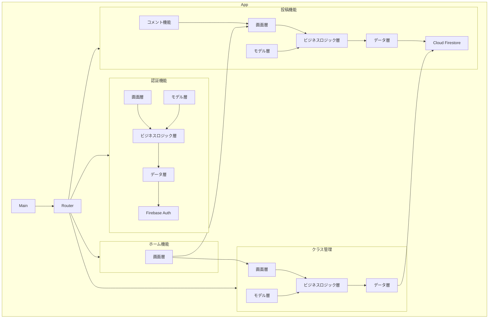
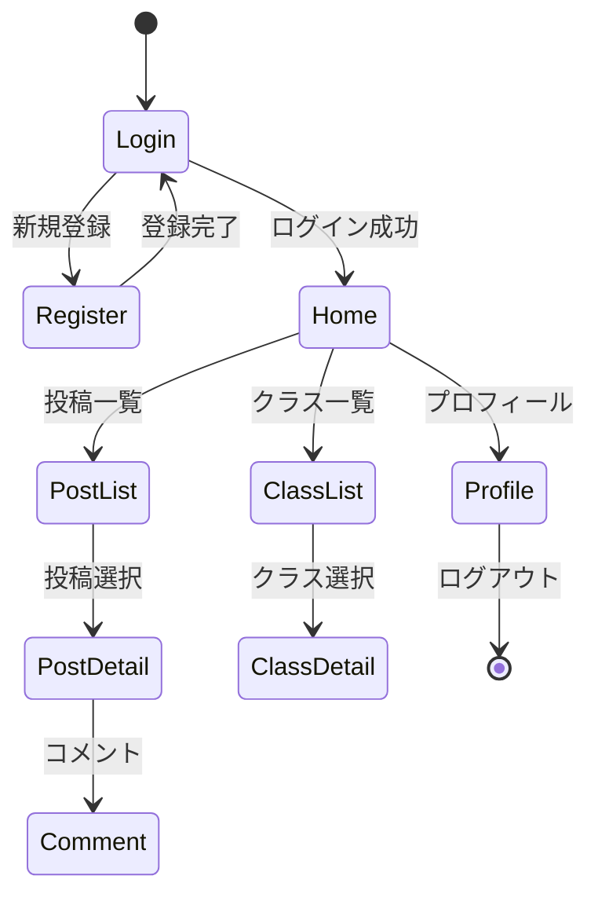
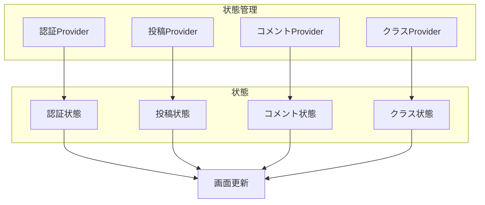

# renrakucho_app

Flutter + Firebase（Firestore, Auth）による連絡帳アプリ

## 主な機能

- ユーザー認証（保護者・教員・管理者）
- 投稿（作成・一覧・詳細・コメント・削除）
- クラス管理（作成・編集・削除・メンバー管理・担任選択）
- コメント機能（投稿へのコメント追加・削除）
- 画面遷移はGoRouter、状態管理はRiverpodを利用

## ディレクトリ構成

```
lib/
  features/
    auth/      ... 認証・ユーザー管理
    class/     ... クラス管理
    home/      ... ホーム画面
    post/      ... 投稿・コメント
    common/    ... 共通ウィジェット・画面
    core/      ... 共通ロジック・ユーティリティ
  providers/   ... グローバルProvider
  routes/      ... ルーティング
  firebase_options.dart ... Firebase設定
  main.dart    ... エントリポイント
```

## 開発メモ

- Firestoreのインデックスが必要な場合はエラーメッセージのリンクから作成
- クラス作成・編集時に担任選択可能（デフォルトは作成者）
- 投稿・コメント・クラスのCRUDは全てFirestore連携
- ログアウトはGoRouterのredirectで自動遷移
- 状態管理はRiverpod（FutureProvider/StateNotifierProvider/StreamProvider等）

## Structure



## 画面遷移図



## 状態管理



## 今後のTODO

- プロフィール画面の実装
- 投稿画像・動画アップロード
- 通知機能
