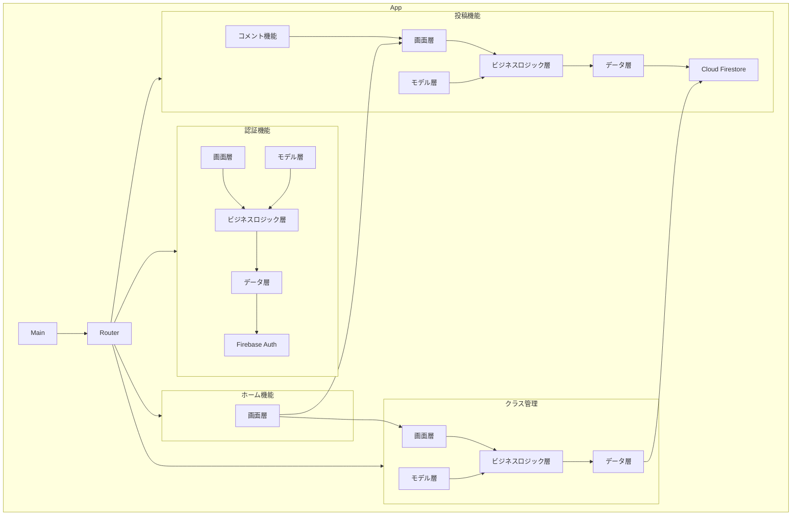
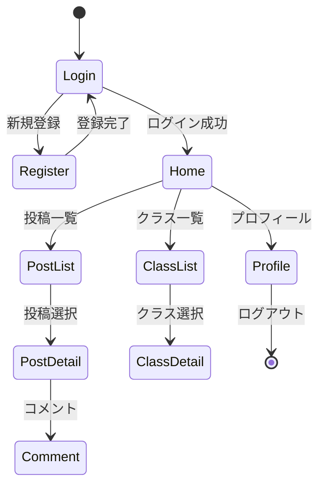
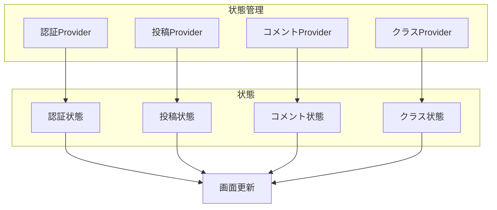

# renrakucho_app

A new Flutter project.

## Structure

```mermaid
graph TB
    subgraph App
        Main --> Router
        Router --> Auth
        Router --> Home
        Router --> Class
        Router --> Post
    end

    subgraph Auth[認証機能]
        AuthView[画面層] --> AuthViewModel[ビジネスロジック層]
        AuthViewModel --> AuthRepository[データ層]
        AuthRepository --> Firebase[Firebase Auth]
        AuthModel[モデル層] --> AuthViewModel
    end

    subgraph Post[投稿機能]
        PostView[画面層] --> PostViewModel[ビジネスロジック層]
        PostViewModel --> PostRepository[データ層]
        PostRepository --> Firestore[Cloud Firestore]
        PostModel[モデル層] --> PostViewModel
        Comment[コメント機能] --> PostView
    end

    subgraph Class[クラス管理]
        ClassView[画面層] --> ClassViewModel[ビジネスロジック層]
        ClassViewModel --> ClassRepository[データ層]
        ClassRepository --> Firestore
        ClassModel[モデル層] --> ClassViewModel
    end

    subgraph Home[ホーム機能]
        HomeView[画面層]
        HomeView --> PostView
        HomeView --> ClassView
    end
```

## Screen transition

```mermaid
stateDiagram-v2
    [*] --> Login
    Login --> Register: 新規登録
    Register --> Login: 登録完了
    Login --> Home: ログイン成功
    Home --> PostList: 投稿一覧
    Home --> ClassList: クラス一覧
    PostList --> PostDetail: 投稿選択
    PostDetail --> Comment: コメント
    ClassList --> ClassDetail: クラス選択
    Home --> Profile: プロフィール
    Profile --> [*]: ログアウト
```

## State management

```mermaid
flowchart TB
    subgraph Providers[状態管理]
        AuthProvider[認証Provider]
        PostProvider[投稿Provider]
        CommentProvider[コメントProvider]
        ClassProvider[クラスProvider]
    end

    subgraph States[状態]
        AuthState[認証状態]
        PostState[投稿状態]
        CommentState[コメント状態]
        ClassState[クラス状態]
    end

    AuthProvider --> AuthState
    PostProvider --> PostState
    CommentProvider --> CommentState
    ClassProvider --> ClassState
    
    AuthState --> Views[画面更新]
    PostState --> Views
    CommentState --> Views
    ClassState --> Views
```
